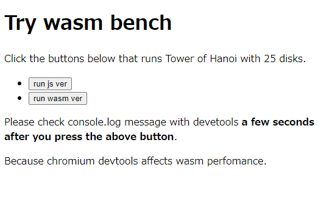
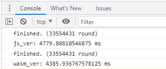

# What's this

計算量O(2n)の[ハノイの塔](https://ja.wikipedia.org/wiki/%E3%83%8F%E3%83%8E%E3%82%A4%E3%81%AE%E5%A1%94)を題材にしてベンチマークを取るためのもの。
- コマンドライン
    - Node.js
    - ネイティブバイナリ
    - WASI
- ブラウザ
    - JS
    - WASM

# Try it out

## CLI Node.js
```shell
$ time ./js/main.js 25
finished. (33554431 round)

real    0m5.172s
user    0m5.185s
sys     0m0.000s
```

## CLI ネイティブバイナリ
```shell
$ cargo build --release
$ time ./target/release/wasm-bench 25
finished. (33554431 round)

real    0m2.289s
user    0m2.289s
sys     0m0.000s
```
## CLI WASI
```shell
$ cargo build --release --target wasm32-wasi
$ time wasmtime ./target/wasm32-wasi/release/wasm-bench.wasm 25
finished. (33554431 round)

real    0m4.283s
user    0m4.284s
sys     0m0.000s
```

## Browser WASM & JS
```shell
$ wasm-pack build --release
$ cd testsite/
$ npm run serve
<i> [webpack-dev-server] Project is running at:
<i> [webpack-dev-server] Loopback: http://localhost:8080/
```



※DevToolsを開いた状態で計測するとWASMの実行が異常に遅くなるという事象が発生してうまく計測できません。

https://twitter.com/tkihira/status/1521736039735635968